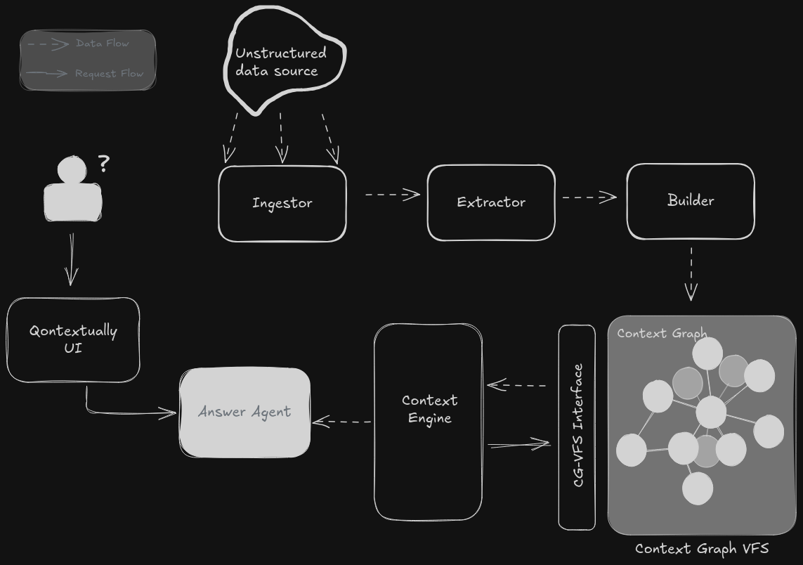
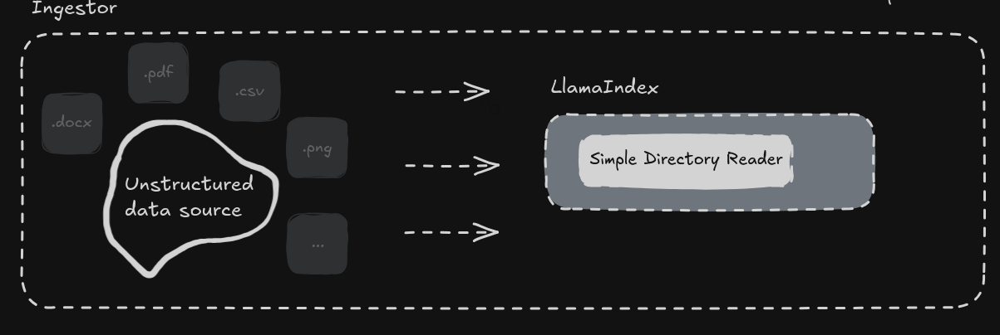
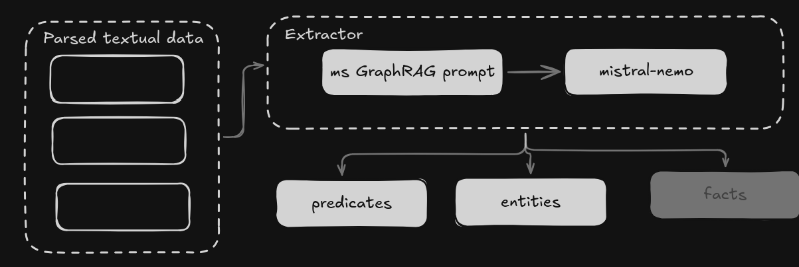
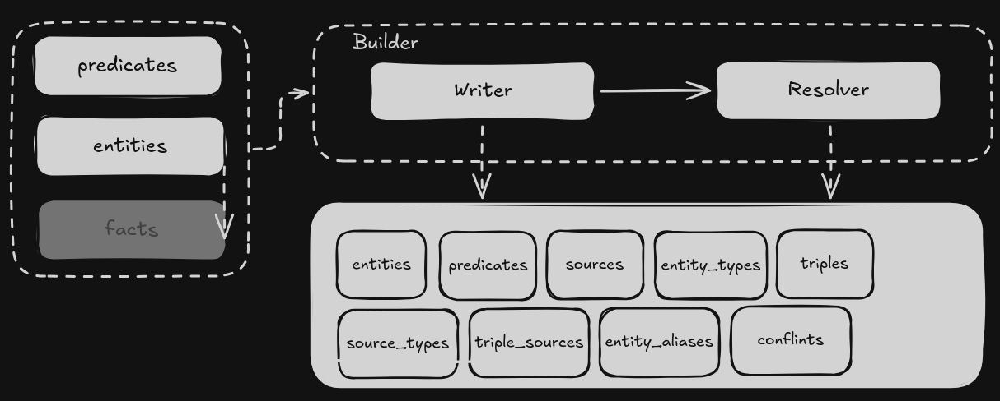
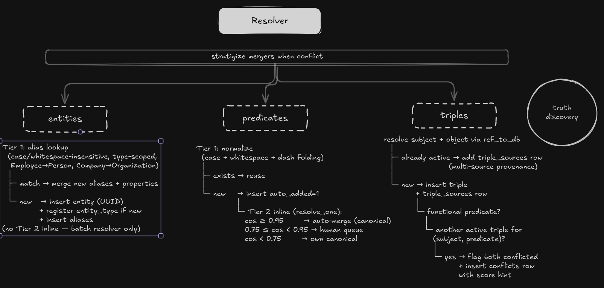

# Qontextually

**A context base that turns messy enterprise data into an inspectable, provenance-backed graph AI agents can actually use.**

Big Berlin Hack — [Qontext track](https://qontext.ai).

---

## What it does

Ingests a simulated enterprise dataset (1,322 files across HR, email, CRM, policy, tickets, chat) and turns every source record into **entities, triples, and sources** in a single SQLite DB. Five design choices make it useful to an agent, not just pretty:

1. **Every triple is backed by one or more source rows.** Provenance is a column, not a hope.
2. **Vocabulary is a registry, not a constraint.** New entity types and predicates land with `auto_added=1` for human review.
3. **Entity resolution is layered.** Tier 1 alias lookup, Tier 2 embedding similarity (sqlite-vec, 1536-dim), ambiguous cases queue for a human.
4. **Predicate resolution mirrors entity resolution.** Tier 1 normalizes case; Tier 2 KNN-merges at cosine ≥ 0.90. The [0.85 threshold is wrong for negation — see docs/DESIGN.md](docs/DESIGN.md#why-cosine-090-and-not-085-or-095).
5. **Conflict-aware by design.** Functional predicates trigger conflict detection on insert; resolution uses authority × confidence × recency.

Current graph: **29,152 entities**, **103,739 triples** (1.87 sources per triple on average), **20,167 sources**, **2,631 predicates**, 117 pending human-review conflicts. Full tier-1 extraction ran on ~21k chunks for ~$5 in LLM cost.

---

## Architecture



Two lanes meet at the graph: **data-flow** (ingest → extract → write) and **request-flow** (question → agent → MCP tools → cited answer).

### Components

| Module | Role |
|---|---|
| `lib/ingestor.py` | Format-extensible loader. Custom `JSONRecordReader` + `CSVRecordReader` preserve per-record provenance; everything else flows through llama-index. |
| `lib/prompts.py` | GraphRAG-derived extraction prompt (MIT-attributed) with enterprise-tuned few-shots. Emits JSON to Pydantic schema. |
| `lib/schemas.py` | Pydantic contract: `Entity`, `Triple`, `ExtractionResult`. Ten validators catch malformed LLM output before any write. |
| `lib/extractor.py` | Three-tier cascading extractor: Mistral-Nemo → Qwen3 → Claude Haiku (strict, with schema patching for Anthropic). Every attempt logged to `audit_log`. |
| `lib/builder/writer.py` | Atomic graph write with Tier-1 entity resolution. Normalizes predicate case, coerces LLM synonyms (`Employee→Person`, `Company→Organization`), dedups triples with `triple_sources` linking. |
| `lib/builder/resolver.py` | Tier-2 predicate resolution. Embeds each auto-discovered predicate with usage context, KNN-merges at cosine ≥ 0.90; ambiguous band queues for review. |
| `lib/ingest.py` | Orchestrator. Walks the dataset, classifies tier-1/tier-2, runs concurrent extraction, resumes from `audit_log`. |
| `lib/embeddings.py` | OpenRouter embeddings client. Writes to `entity_embeddings` + sqlite-vec KNN mirror. |
| `db/db.py` | Single connection chokepoint. Loads sqlite-vec, creates vec0 tables idempotently. |
| `lib/api.py` | 14 FastAPI endpoints powering the Lovable HITL UI (conflicts, vocabulary, entities, sources, 3D subgraph). All writes go through `lib.builder`. |
| `lib/mcp_server.py` | MCP stdio server, 5 read tools: `search_context`, `get_entity`, `get_provenance`, `list_entities_by_type`, `get_source`. |
| `lib/agent.py` | Multi-MCP terminal Q&A agent. Mounts our graph server + Tavily's hosted web-search server through one `AsyncExitStack`; `session_by_tool` routes calls; `--speak` pipes final answer through Gradium TTS. |
| `lib/voice.py` | Gradium TTS voice-out. Playback auto-picks a wired analog sink (Bluetooth sinks wedge on Linux). |
| `lib/agent_replay.py` | Zero-cost demo replay. Re-executes saved trace tool calls live against the right MCP server; no LLM calls. |
| `migrations/` | 11 versioned SQL files. FTS5 with porter+unicode61, partial unique indexes, merge-history tables that survive hard-deletes. |

### Pipeline, step by step

The four diagrams below walk the data-flow lane from raw file to written triple.

**1. Ingestor** — per-record splitting with format-aware custom readers (`lib/ingestor.py`):



**2. Extractor** — three-tier cascading LLM extraction with per-attempt audit logging (`lib/extractor.py`):



**3. Builder / writer** — one atomic transaction per chunk: sources row, Tier-1 entity resolution, Tier-1 predicate normalization, triple upsert with multi-source provenance, inline conflict detection on functional predicates (`lib/builder/writer.py`):



**4. Builder / resolver** — Tier-2 predicate resolution via embeddings; auto-merges at cosine ≥ 0.95, queues the 0.75–0.95 ambiguous band for human review (`lib/builder/resolver.py`):



---

## Three partner technologies

The BBH Qontext track asks for three partner integrations. Each is used where it genuinely pulls weight:

- **Lovable — the HITL UI.** `lib/api.py` exposes 14 typed REST endpoints; a Lovable-built frontend consumes them for conflict resolution, vocabulary promotion, entity/source browsing, and a 3D graph viz. Writes go through the same `lib.builder` layer as the ingest pipeline, so the UI is always a presentation of the real graph.
- **Tavily — external search via MCP.** Mounted alongside our stdio server inside `lib/agent.py`. For compliance questions like *"does Inazuma's leave policy meet the German legal minimum?"*, the agent consults internal sources first, then Tavily only when external grounding is required. The final answer cites `§ 3 BUrlG` alongside `triple #103564`. See `data/demo_qa/q5_compliance.json`.
- **Gradium — voice-out for the agent.** `lib/voice.py` wraps `gradium.tts()` and a playback helper that skips Bluetooth sinks (which wedge on Linux). `--speak` on either the live agent or the replay reads the final answer aloud.

Keys in `.env`: `OPENROUTER_API_KEY`, `TAVILY_API_KEY`, `GRADIUM_API_KEY`. Replay works without Tavily or Gradium — they're additive.

---

## Run it

### Prerequisites
- **Python 3.12–3.14**
- **[`git-lfs`](https://git-lfs.com)** — install **before** `git clone`. The prebuilt 225 MB graph (`db/qontextually.db`) ships via Git LFS; without LFS the file clones as a 134-byte pointer and nothing works. Most modern git installs already include it; verify with `git lfs version`.
- **[Bun](https://bun.sh) or `npm`** — only if you want the web UI. `make ui-dev` auto-detects (Bun preferred to match `ui/bun.lockb`).

Everything else is handled by the Makefile: `make setup` installs [`uv`](https://github.com/astral-sh/uv), creates `.venv`, and syncs Python deps; `make migrate` applies the SQL migrations.

Optional, only if you exercise specific surfaces:
- `ffmpeg` + ALSA `arecord` — voice in/out via Gradium STT/TTS
- `npx` — for the zero-LLM MCP Inspector (see [Use your own MCP client](#use-your-own-mcp-client))
- API keys (`.env`): `OPENROUTER_API_KEY` for the live agent or re-extraction · `TAVILY_API_KEY` for web search · `GRADIUM_API_KEY` for voice. None needed for the replay demo or the UI.

### Instant demo (no API key)
```bash
git clone <repo-url> && cd qontextually
make setup     # installs uv + deps into .venv
make migrate   # applies migrations into db/qontextually.db
make ui        # sqlite-web at localhost:8080
```
The committed `db/qontextually.db` contains the full extracted graph.

### Query the graph
```bash
# Internal graph only
.venv/bin/python -m lib.agent "What does the Leave Policy say about vacation?" --no-web

# Internal + Tavily web (requires TAVILY_API_KEY)
.venv/bin/python -m lib.agent "Does Inazuma's leave policy meet the German legal minimum?"

# Read the answer aloud via Gradium TTS
.venv/bin/python -m lib.agent "What does the Leave Policy say about vacation?" --no-web --speak
```
`qwen/qwen3-next-80b-a3b-instruct` primary, `gpt-4o-mini` fallback. `--save-trace path.json` captures everything for replay.

### Replay a demo without an API key
Tool calls execute live; final answer is replayed from trace. $0 on OpenRouter.
```bash
.venv/bin/python -m lib.agent_replay data/demo_qa/q5_compliance.json
.venv/bin/python -m lib.agent_replay --all data/demo_qa/
.venv/bin/python -m lib.agent_replay data/demo_qa/q5_compliance.json --speak
```
Five traces ship in `data/demo_qa/` — four pure-internal and one hybrid (the compliance question above).

### HITL UI
The review console (dashboard, conflicts, vocabulary, entities, sources, 3D graph) is a TanStack Start (React + Vite) app vendored into `ui/`. It was originally generated in [Lovable](https://lovable.dev) and snapshotted from <https://github.com/b3ll9trix/qontextual-navigator>.

```bash
make demo       # one shot: API on :8000 (detached) + UI dev server (foreground)

# or run the two halves separately:
make api        # backend on http://127.0.0.1:8000 detached
make ui-dev     # UI on http://localhost:5173
make api-stop   # stop the backend
make ui-build   # static bundle in ui/dist/ if you want to deploy
```

`make ui-dev` uses [Bun](https://bun.sh) if present (matches `ui/bun.lockb`); otherwise falls back to `npm` (the committed `package-lock.json`). Override the API base with `VITE_API_URL` (defaults to `http://localhost:8000`). Smoke-test the API alone: `curl http://127.0.0.1:8000/health`.

### Use your own MCP client
Our server exposes 5 read tools (`search_context`, `get_entity`, `get_provenance`, `list_entities_by_type`, `get_source`) over stdio. Any MCP client can consume them — there's no port to bind, the client spawns the server on demand.

> **For jurors / 30-second drive-by:** open the graph in your browser without an LLM, an API key, or our UI:
> ```bash
> npx @modelcontextprotocol/inspector .venv/bin/python -m lib.mcp_server
> ```
> All 5 tools appear in a UI with form-fillable inputs. Click `search_context`, type `Leave Policy`, hit Run — you'll get live JSON back from the graph.

**Claude Code** — one line:
```bash
claude mcp add qontextually ".venv/bin/python -m lib.mcp_server" --cwd "$(pwd)"
```

**Claude Desktop** (`~/.config/Claude/claude_desktop_config.json`) — same dual-server setup our own agent uses:
```json
{
  "mcpServers": {
    "qontextually": {
      "command": "python",
      "args": ["-m", "lib.mcp_server"],
      "cwd": "/absolute/path/to/qontextually"
    },
    "tavily": {
      "url": "https://mcp.tavily.com/mcp/?tavilyApiKey=YOUR_TAVILY_KEY"
    }
  }
}
```

### Rebuild from scratch (optional, ~$5, ~2h)
```bash
cp .env.example .env   # add OPENROUTER_API_KEY
git clone https://huggingface.co/datasets/AST-FRI/EnterpriseBench sample_dataset
cd sample_dataset && git lfs pull && cd ..
.venv/bin/python -m lib.ingest --tier 1 --workers 8
.venv/bin/python -m lib.builder.resolver  # merge synonyms, queue ambiguous
```

---

## Dataset

| Domain | Source type | Authority |
|---|---|---|
| HR records (2,327 docs) | `hr` | 1.00 |
| CRM (4,475 docs) | `crm` | 0.80 |
| Policy PDFs (169 pages) | `policy` | 0.70 |
| IT tickets (163) | `ticket` | 0.50 |
| Email (11,928) | `email` | 0.40 |
| Chat / social (3,868) | `chat` | 0.30 |
| Business records (800) | `crm` | 0.80 |
| Tier-2: Inazuma Overflow (10,823 Q&A), Workspace (750) | `unknown` | 0.50 |

Authority weights drive conflict resolution: when HR (1.00) and email (0.40) disagree on a title, HR wins; ambiguous cases queue for a human.

---

## More

- Design notes & engineering rationale → [docs/DESIGN.md](docs/DESIGN.md)
- Architecture diagram → [docs/architecture.png](docs/architecture.png)
- 24-hour build log → git log

---

## License

MIT. Extraction prompt in `lib/prompts.py` adapted from [microsoft/graphrag](https://github.com/microsoft/graphrag) (MIT, attributed in-module).

## Author

Reshma Suresh — [github.com/b3ll9trix](https://github.com/b3ll9trix)
